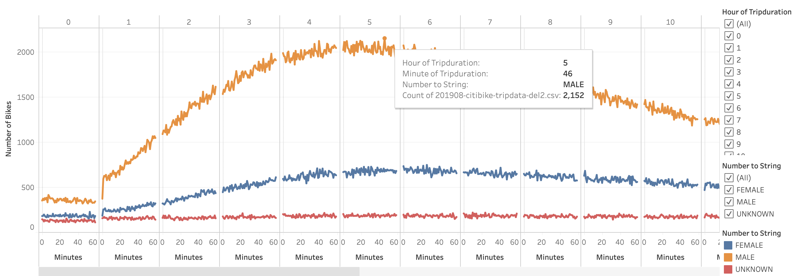
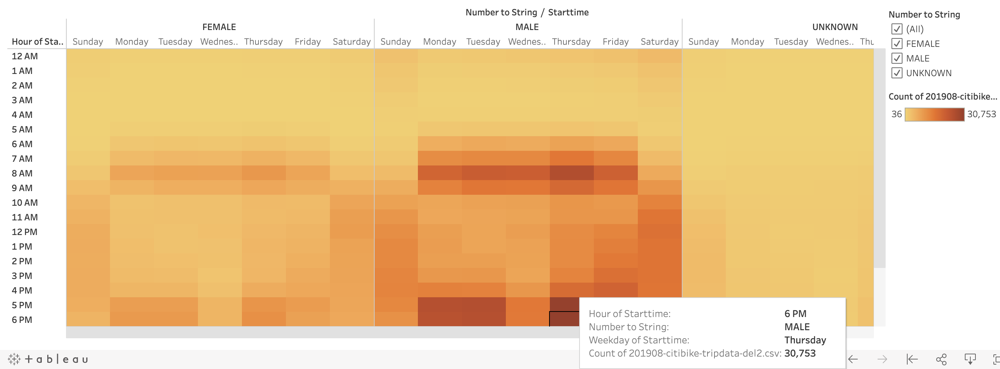

# NYC Citibike Challenge

## Overview

The purpose of this statistical analysis is to pitch a business proposal of bike-sharing program in Des Moines to key stake holders. Analysis is performed on the available NYC Citibike Data.

## Results

Following are the results of this analysis:

### Checkout Times by Users
Highest number of bikes were checked out at 05:15 hrs

### Checkout Time by Gender
Majority of the bike riders are "Male", owing to highest number of bikes at 05:46 hrs

### Trips by Weekday per Hour
Peak hours of trips are at 6pm on Thursdays

### Trips by Gender
Highest number of users at 6pm on Thursdays are "Male"

### User Trips by Gender by Weekday
Thursdays are the peak hours utilized by subscribers and highest number is again "Male

### August Peak Hours
For the month of August, highest number of trips were made at 17:00 hrs

### Top Starting Location
Most number of trips were from Manhattan and Lower Manhattan area

## Summary
- Looking at the NYC Citibike data, it is highly likely that starting a similar business in Des Moines downtown district where bike trails are available would lead to more success. 

- The data also tells us that the highest number of subscribers and users are male population. 

- Looking at the heat map, we can also conclude that the peak hours are around 8am and 5-6pm almost every day of the week.

### Tableau Public link
[link to dashboard](https://public.tableau.com/profile/muhammad.ovais.naeem#!/vizhome/NYC_Citibike_Challenge_16042896757240/NYCCitibikeAnalysis?publish=yes)

### Suggestion for Additional Visualizations
Following suggestions can be made for additional visualizations to get further insight into the data:

- One visualization can be done based on "Trips by Age Group" so that we can target the customers based on their age and make sure adequate number of bikes are availble during those hours.

- Another visualization can be made based on "Trips by Age Group per Hour" which would tell us which age group are mostly using the bikes on hourly basis.